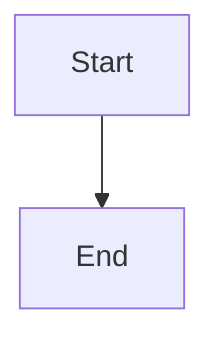

# Quick Test - Markdown Renderer (2 Minutes)

## 🚀 Fast Track Testing

### Step 1: Start Server (30 seconds)
```bash
cd /home/thepg/Projects/BookWorm/bookworm
npm run dev
```

**Wait for:** `▲ Next.js running on http://localhost:3000`

---

### Step 2: Open & Navigate (30 seconds)
1. Open browser: `http://localhost:3000`
2. Sign in (any mock user)
3. Click any notebook
4. Click "Edit Note" on a note

---

### Step 3: Test Math (30 seconds)

**Add new block, paste this:**
```markdown
# Math Test

Einstein: $E = mc^2$

Integral:
$$
\int_{0}^{\infty} x^2 dx
$$
```

**Click Save → Back to Reader**

**✅ Expected:** Math renders beautifully, not raw LaTeX  
**❌ If broken:** Shows `$E = mc^2$` as text

---

### Step 4: Test Diagram (30 seconds)

**Add new block, paste this:**
````markdown
# Diagram Test


````

**Click Save → Back to Reader**

**✅ Expected:** Visual flowchart with arrows  
**❌ If broken:** Shows code block or error

---

## 📊 Report Results

**Tell me:**

1. **Math Test:** ✅ PASS or ❌ FAIL
2. **Diagram Test:** ✅ PASS or ❌ FAIL
3. **Any console errors?** (F12 → Console tab)

**If both pass:** Renderer is production-ready! 🎉  
**If either fails:** Share the console error messages.

---

## 🎨 What Success Looks Like

### Math Rendering (Success)
- Formulas look like textbook math
- Fractions are stacked
- Integrals have proper symbols
- Superscripts/subscripts positioned correctly

### Diagram Rendering (Success)
- Visual boxes and arrows
- Text labels visible
- Dark theme (matching UI)
- No code blocks visible

---

## 🐛 Common Issues

### Issue: Math shows as text
**Fix:** Reload page (KaTeX loads async)

### Issue: Diagram shows "Error"
**Fix:** Check syntax, reload page

### Issue: Nothing renders
**Fix:** Check console (F12), share errors

---

**For full testing:** See `MARKDOWN_RENDERER_TESTING.md`
