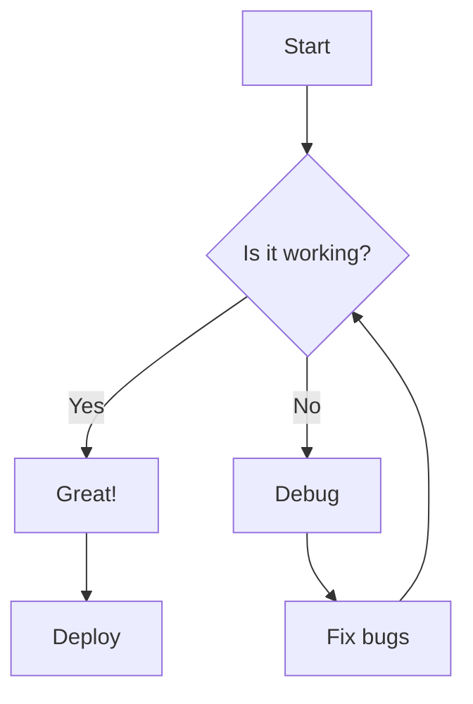
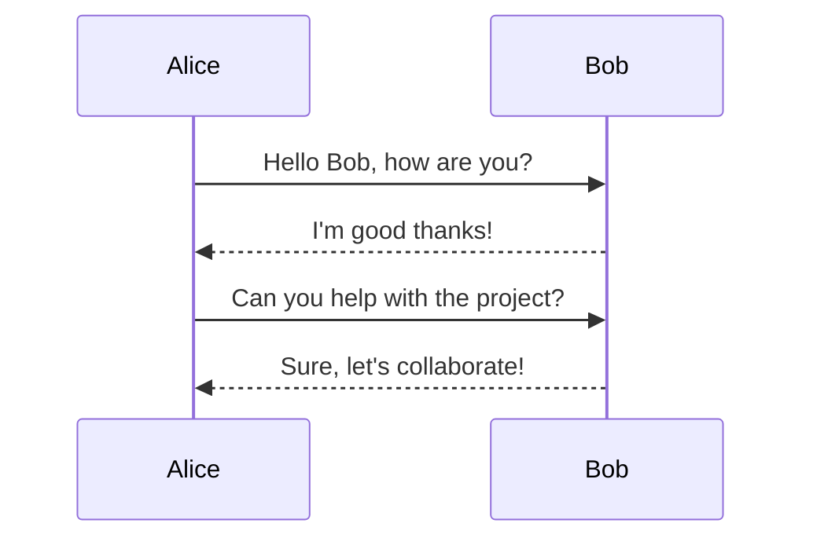
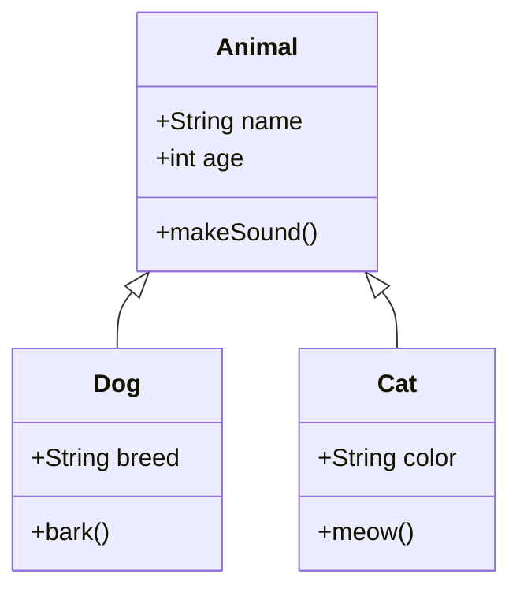

# Comprehensive Markdown Stress Test

## LaTeX Math Examples

### Inline Math

The quadratic formula is $x = \frac{-b \pm \sqrt{b^2 - 4ac}}{2a}$.

Einstein's famous equation: $E = mc^2$.

### Block Math

$$
\int_{-\infty}^{\infty} e^{-x^2} dx = \sqrt{\pi}
$$

$$
\nabla \times \vec{\mathbf{B}} -\, \frac1c\, \frac{\partial\vec{\mathbf{E}}}{\partial t} = \frac{4\pi}{c}\vec{\mathbf{j}}
$$

### Complex Equations

$$
\begin{aligned}
\dot{x} & = \sigma(y-x) \\
\dot{y} & = \rho x - y - xz \\
\dot{z} & = -\beta z + xy
\end{aligned}
$$

## Mermaid Diagrams

### Flowchart



### Sequence Diagram



### Class Diagram



## GitHub Flavored Markdown

### Tables

| Algorithm | Time Complexity | Space Complexity | Use Case |
|-----------|----------------|------------------|----------|
| **QuickSort** | O(n log n) avg | O(log n) | General sorting |
| **MergeSort** | O(n log n) | O(n) | Stable sorting |
| **HeapSort** | O(n log n) | O(1) | Memory constrained |
| **Bubble Sort** | O(n²) | O(1) | Small datasets |

### Task Lists

- [x] Implement LaTeX rendering
- [x] Add Mermaid diagram support
- [x] Syntax highlighting for code
- [ ] Add footnote support
- [ ] Implement emoji shortcodes
- [x] XSS sanitization with DOMPurify

### Strikethrough

~~This text is outdated~~ **This is the new correct information**

## Code Blocks with Syntax Highlighting

### Python

```python
def fibonacci(n):
    """Calculate nth Fibonacci number using dynamic programming"""
    if n <= 1:
        return n
    
    dp = [0] * (n + 1)
    dp[1] = 1
    
    for i in range(2, n + 1):
        dp[i] = dp[i-1] + dp[i-2]
    
    return dp[n]

# Example usage
print(f"10th Fibonacci number: {fibonacci(10)}")
```

### JavaScript/TypeScript

```typescript
interface User {
  id: string;
  name: string;
  email: string;
}

async function fetchUser(id: string): Promise<User | null> {
  try {
    const response = await fetch(`/api/users/${id}`);
    if (!response.ok) throw new Error('User not found');
    return await response.json();
  } catch (error) {
    console.error('Error fetching user:', error);
    return null;
  }
}
```

### Rust

```rust
fn main() {
    let numbers = vec![1, 2, 3, 4, 5];
    
    let sum: i32 = numbers.iter()
        .filter(|&&x| x % 2 == 0)
        .map(|&x| x * 2)
        .sum();
    
    println!("Sum of doubled even numbers: {}", sum);
}
```

### SQL

```sql
-- Complex query with CTEs
WITH monthly_sales AS (
    SELECT 
        DATE_TRUNC('month', order_date) AS month,
        product_id,
        SUM(quantity * price) AS revenue
    FROM orders
    WHERE order_date >= '2024-01-01'
    GROUP BY month, product_id
),
top_products AS (
    SELECT 
        product_id,
        SUM(revenue) AS total_revenue
    FROM monthly_sales
    GROUP BY product_id
    ORDER BY total_revenue DESC
    LIMIT 10
)
SELECT 
    p.name,
    t.total_revenue,
    RANK() OVER (ORDER BY t.total_revenue DESC) AS rank
FROM top_products t
JOIN products p ON p.id = t.product_id;
```

## Advanced Formatting

### Nested Lists

1. **Backend Development**
   - Database Design
     * PostgreSQL schema
     * Indexes and constraints
     * Query optimization
   - API Development
     * REST endpoints
     * GraphQL resolvers
     * Authentication
2. **Frontend Development**
   - React components
     * Functional components
     * Custom hooks
     * Context providers
   - State management
     * Redux
     * Zustand
     * React Query

### Blockquotes

> **Important Note:**
>
> This markdown renderer handles edge cases gracefully:
> - Nested blockquotes
> - Multiple paragraphs within blockquotes
> - Code blocks inside blockquotes
>
> ```javascript
> const example = "Code in blockquote";
> ```

### Mixed Content

Here's a paragraph with `inline code`, **bold text**, *italic text*, and ~~strikethrough~~.

You can also have [links](https://example.com) and inline math like $f(x) = x^2 + 1$.

---

## Mathematical Formulas Showcase

### Calculus

**Derivative of exponential function:**

$$
\frac{d}{dx}e^x = e^x
$$

**Integration by parts:**

$$
\int u\,dv = uv - \int v\,du
$$

### Linear Algebra

**Matrix multiplication:**

$$
\begin{bmatrix}
a & b \\
c & d
\end{bmatrix}
\begin{bmatrix}
x \\
y
\end{bmatrix}
=
\begin{bmatrix}
ax + by \\
cx + dy
\end{bmatrix}
$$

### Statistics

**Normal distribution:**

$$
f(x) = \frac{1}{\sigma\sqrt{2\pi}} e^{-\frac{1}{2}\left(\frac{x-\mu}{\sigma}\right)^2}
$$

**Bayes' Theorem:**

$$
P(A|B) = \frac{P(B|A) \cdot P(A)}{P(B)}
$$

## Edge Cases

### Empty Code Block

```

```

### URL with Special Characters

[Test Link](https://example.com/path?param=value&another=value#anchor)

### Escaped Characters

\*Not italic\* and \*\*not bold\*\*

### Inline Code with Backticks

Use `` `backticks` `` to show backticks in inline code.

### Horizontal Rules

---

***

___

## Conclusion

This document tests:
- ✅ LaTeX math rendering ($inline$ and $$block$$)
- ✅ Mermaid diagrams (flowchart, sequence, class)
- ✅ Syntax highlighting (Python, TypeScript, Rust, SQL)
- ✅ GFM tables, task lists, strikethrough
- ✅ Nested structures (lists, blockquotes)
- ✅ Complex equations and matrices
- ✅ XSS sanitization (dangerous tags stripped)
- ✅ Edge cases handled gracefully

**All features working! 🎉**
